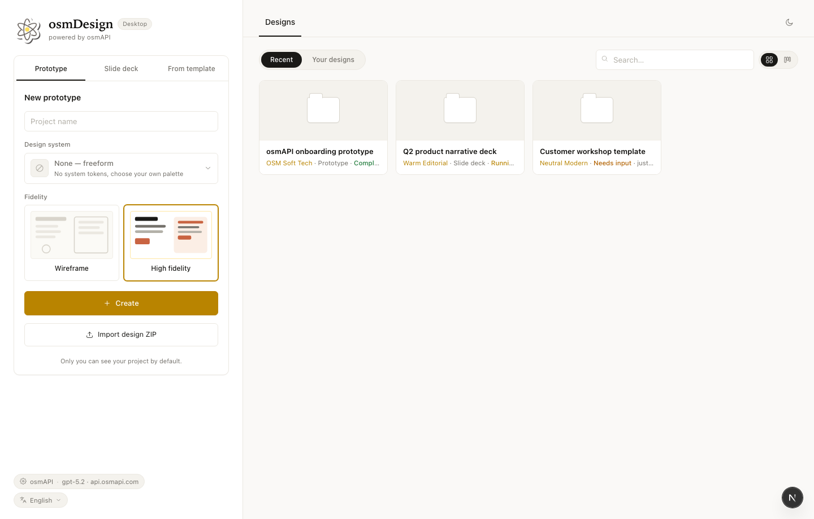
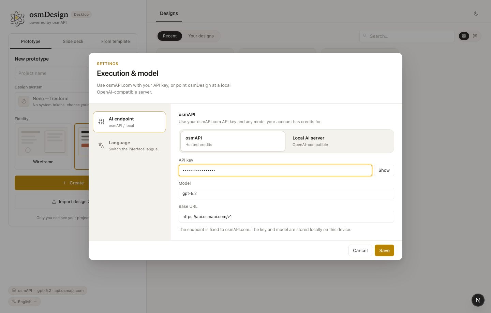
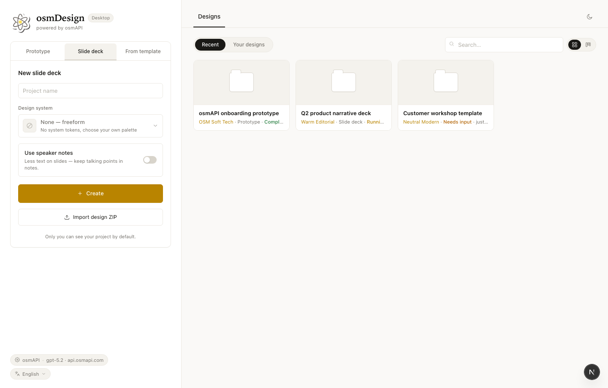
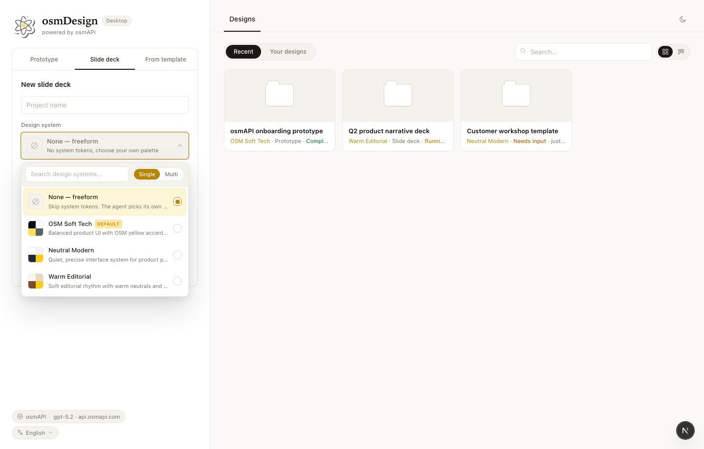
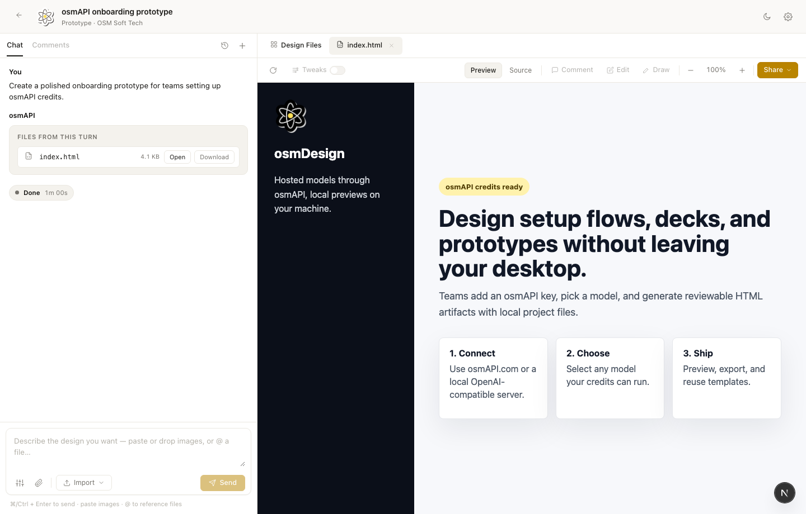
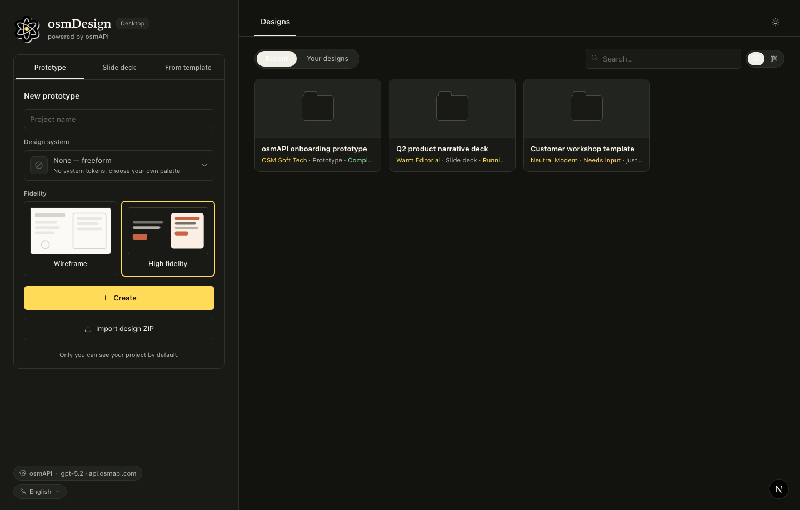

# osmDesign

osmDesign is a local-first AI design workspace for prototypes, slide decks, and reusable templates. It pairs a web workspace with a local daemon and desktop shell so generated files stay on your machine while the app handles previewing, editing, exports, and project history.

## What It Does

- Create responsive prototypes from a brief, design-system notes, and reference files.
- Create slide decks with speaker notes and optional motion.
- Save a project as a reusable template and start new work from it later.
- Use osmAPI.com for hosted AI models, or connect a local OpenAI-compatible server such as Ollama or LM Studio.
- Package the workspace as a desktop app for macOS and Windows.

## Screenshots

| Workspace home | osmAPI settings |
| --- | --- |
|  |  |

| Project creation | Design-system picker |
| --- | --- |
|  |  |

| Project workspace | Dark theme |
| --- | --- |
|  |  |

## AI Providers

osmDesign keeps provider setup deliberately narrow:

- **osmAPI.com** for hosted models. Add your osmAPI key and enter any model your account has credits for.
- **Local AI server** for OpenAI-compatible endpoints running on your machine.

The app does not require sessions or account storage inside the desktop app.

## Repository Layout

- `apps/web` - Next.js workspace UI.
- `apps/daemon` - local daemon for projects, previews, files, imports, exports, and model proxying.
- `apps/desktop` - Electron shell.
- `apps/packaged` - packaged desktop runtime entrypoint.
- `packages/contracts` - shared web/daemon request and response contracts.
- `packages/sidecar-proto`, `packages/sidecar`, `packages/platform` - sidecar and process-control primitives.
- `tools/dev` - local development launcher.
- `tools/pack` - desktop packaging helpers.

## Quick Start

```bash
corepack enable
pnpm install
pnpm tools-dev start web
```

The development launcher starts the local daemon and web UI, then prints the browser URL.

## Useful Commands

```bash
pnpm typecheck
pnpm test
pnpm build
pnpm --filter @osmdesign/web typecheck
pnpm --filter @osmdesign/daemon test
pnpm --filter @osmdesign/tools-pack build
```

## Desktop Packaging

macOS packaging is handled by the local packaging tool:

```bash
pnpm tools-pack mac build --to all
```

Windows packaging is part of the desktop packaging roadmap and uses the same app/runtime boundaries.

## License

See `LICENSE`.
